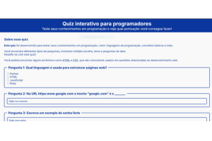

# 🎯 Quiz de Programação

Um quiz interativo desenvolvido com HTML e CSS para testar conhecimentos em programação.

Este quiz foi desenvolvido para testar seus conhecimentos em programação, abrangendo alguns tópicos como:

### 📸 Preview  
Veja abaixo como o quiz se parece em ação:  

## 🚀 Acesse o Projeto  
Teste seus conhecimentos agora mesmo!  

🔗 [Acesse o Quiz de Programadores](https://geovanigaldino.github.io/quiz-de-programadores/)

## 🚀 Tecnologias Utilizadas

- HTML5
- CSS3
- Design responsivo

## 📝 Licença

Este projeto está sob a licença MIT. Veja o arquivo [LICENSE](LICENSE) para mais detalhes.

## 📧 Contato

Se você tiver alguma dúvida ou sugestão, sinta-se à vontade para abrir uma issue ou entrar em contato.
